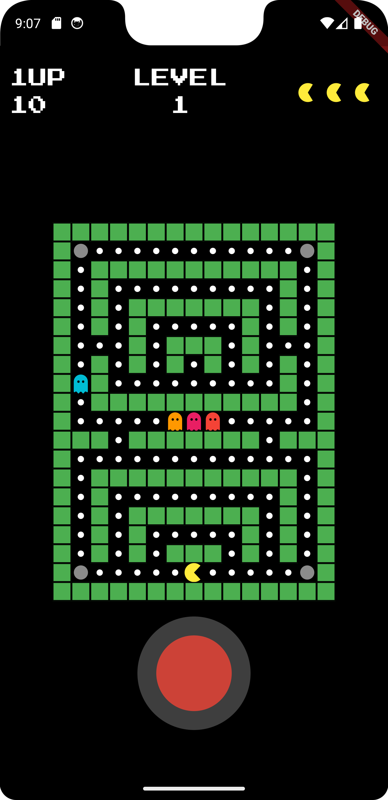
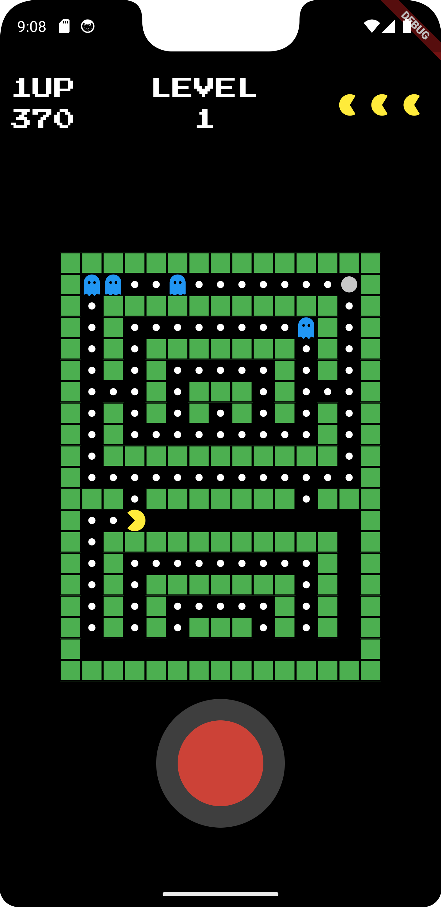

# Pacman Clone

A modern Pacman clone built with Flutter! Navigate through levels, eat dots, avoid ghosts, and aim for the highest score. This project demonstrates advanced game logic, animations, and interactive UI.

## Features

- Classic Pacman gameplay with modern enhancements.
- Multiple levels with increasing difficulty.
- Different ghost behaviors: chase, ambush, random, and patrol.
- Power pellets for ghost vulnerability.
- Customizable joystick for smooth navigation.
- Animated grid, Pacman mouth, and ghost flashing effects.

## Screenshots

### Start Screen


### Gameplay


## Getting Started

1. Clone the repository:
   ```bash
   git clone https://github.com/your-username/pacman-clone.git
   ```

2. Navigate to the project directory:
   ```bash
   cd pacman-clone
   ```

3. Install dependencies:
   ```bash
   flutter pub get
   ```

4. Run the app:
   ```bash
   flutter run
   ```

## Dependencies

- [flutter_joystick](https://pub.dev/packages/flutter_joystick): Provides joystick functionality.
- [font_awesome_flutter](https://pub.dev/packages/font_awesome_flutter): Icons for ghosts.

## How to Play

- Use the virtual joystick to move Pacman.
- Eat all dots to progress to the next level.
- Avoid ghosts or eat them when they're vulnerable after consuming a power pellet.
- Clear all levels to win the game.

## Project Structure

- `lib/main.dart`: Entry point of the app.
- `lib/models`: Game logic, including Pacman, ghosts, and grid.
- `lib/views/game_view.dart`: UI and gameplay logic.
- `lib/utils/constants.dart`: Game constants and configurations.

## Created By

Developed by [CodēCodes](https://www.cod-e-codes.com/). Check out more projects on [GitHub](https://github.com/Cod-e-Codes/).

---

Enjoy the classic Pacman experience with a modern twist!
